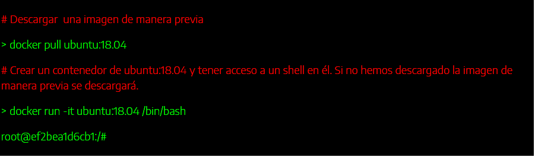
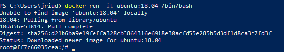
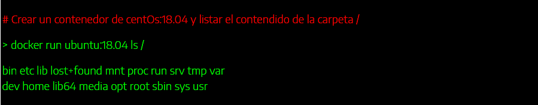
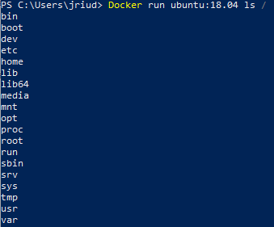
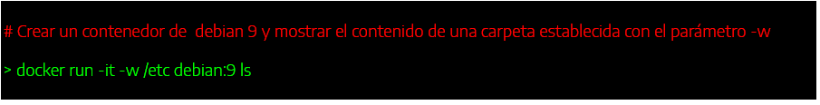
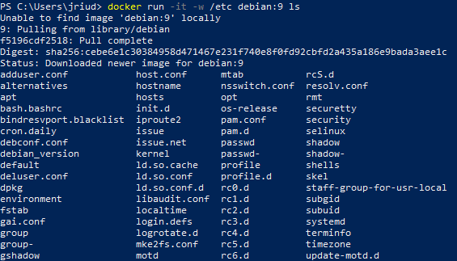
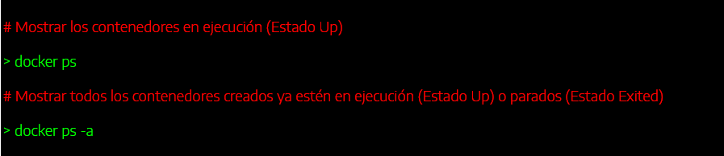
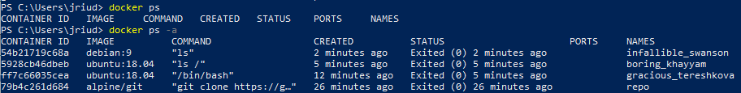

# EJEMPLOS CONTENEDORES

# Ejemplo 1

- "Docker pull ubuntu:18.04" es un comando que descarga una imagen de Ubuntu
-  Pero si unas "Docker run -it ubuntu:18.04 /bin/bash" descarga la imagen de Ubuntu y entra al usuario root directamente.

- Como se puede observar ha creado un ontenedor donde ha guardado la imagen que ha descargado y ha acabado dentro del root.
- 
# Ejemplo 2

- "Docker run ubuntu:18.04 ls /" se direcciona en carpeta donde previamente hemos instalado la imagen de Ubuntu.
- Ejecuta el comando "ls" lo que muestra el contenido de dicha carpeta.

# Ejemplo 4

- "Docker run -it -w /etc debian:9 ls" descarga una imagen de Debian.
-  Ejecuta un "ls" en la carpeta etc de Debian y sale del contenedor.

- "Docker ps" muestra los contenedores que tenemos en ejecución.
- "Docker ps -a" muestra todos los contenedores existententes, estén en ejecucion o no.

